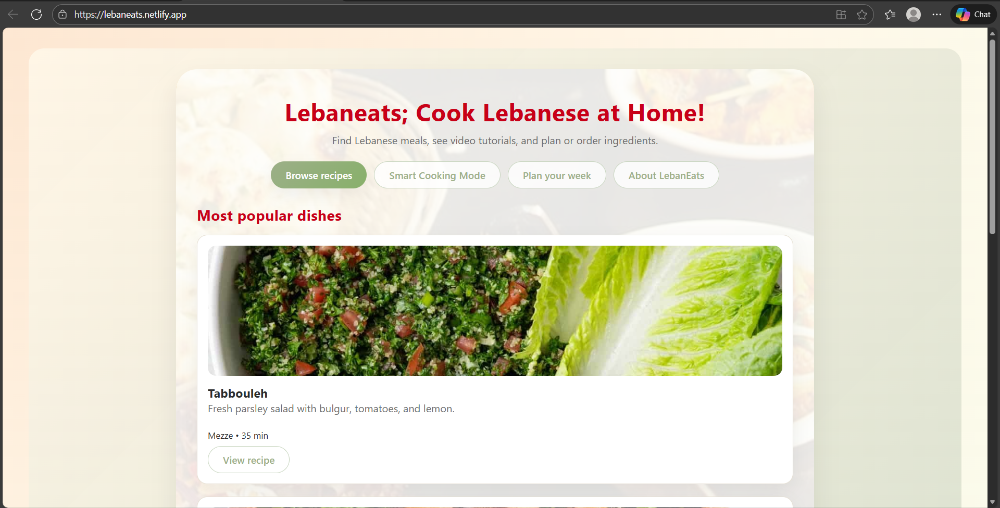
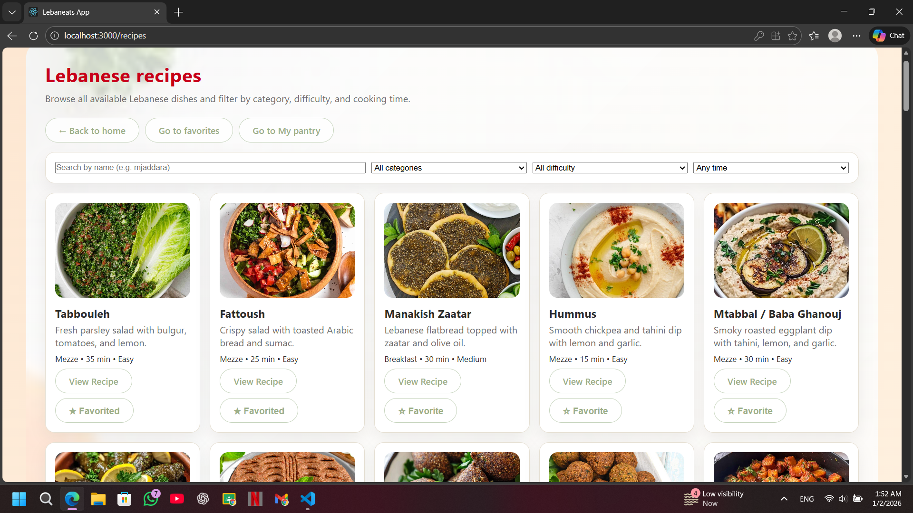
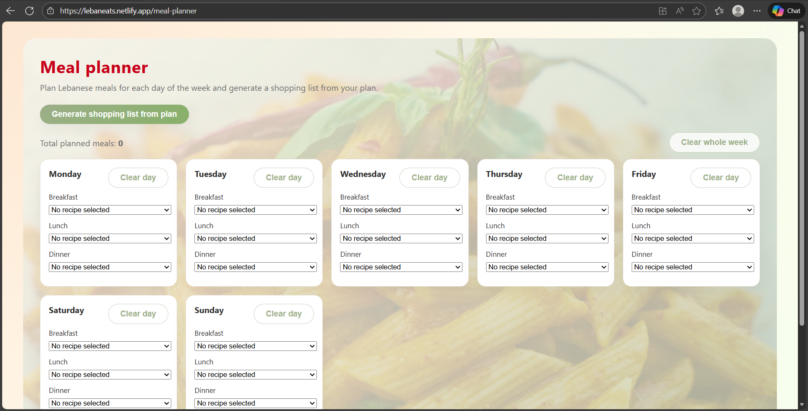
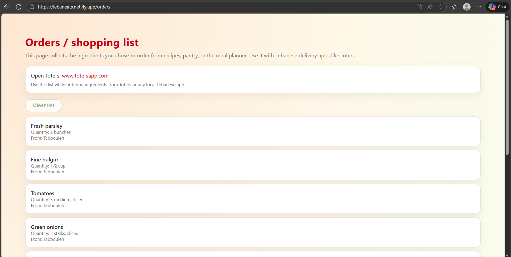

###Lebaneats – Lebanese Recipe Web App:

Lebaneats is a modern, responsive ReactJS web application designed to showcase authentic Lebanese dishes and help users plan their weekly meals.  

###Description:

Lebaneats provides users with an elegant interface to browse Lebanese recipes, view ingredients and steps, plan meals for the week, generate shopping lists, and explore additional features. The application is fully responsive, visually cohesive, and includes page animations and a custom splash screen.

Phase 1 focuses on the complete front-end UI, routing system, and dynamic recipe page.

###Features:
1-Home Page
- Animated splash screen on first load  
- Clean welcome landing page  
- Buttons for quick navigation  

2-Recipes Page
- All recipes displayed dynamically from `recipeData.js`  
- Search & filter system  
- Individual recipe pages with:
  - Ingredients  
  - Step-by-step instructions  
  - Cooking timer and step counter  

3-Meal Planner
- Weekly meal planner (Breakfast, Lunch, Dinner)  
- Ability to assign recipes to days  
- Generate shopping list from planned meals  

4-Orders / Shopping List
- All selected ingredients grouped in a single shopping list page  

5-Favorites Page
- Add/remove recipes from favorites  

6-Static Pages
- About page  
- Contact page  

###UI Enhancements:
- Responsive layout for mobile & desktop  
- Page transition animations using Framer Motion  
- Custom splash screen with animated logo  

###Technologies Used:

--> Frontend:
- ReactJS (functional components + hooks)
- React Router DOM
- Framer Motion (page animations)
- CSS3 (custom styling)
- JavaScript (ES6+)

--> Tools:
- Node.js
- Git & GitHub Version Control
- Netlify / Vercel / GitHub Pages (Deployment)

---

###Screenshots of UI:

 Home Page  :

Recipes Page :  

Meal Planner : 

Shopping List:

---

###Live Deployment:

 **Live URL:** https://lebaneats.netlify.app/
---

 ###Contributors : **Fatima Atieh** / **Ghiwa Ayash**

## 📄 License
This project is developed for educational purposes under the Web Programming & Technologies course.
